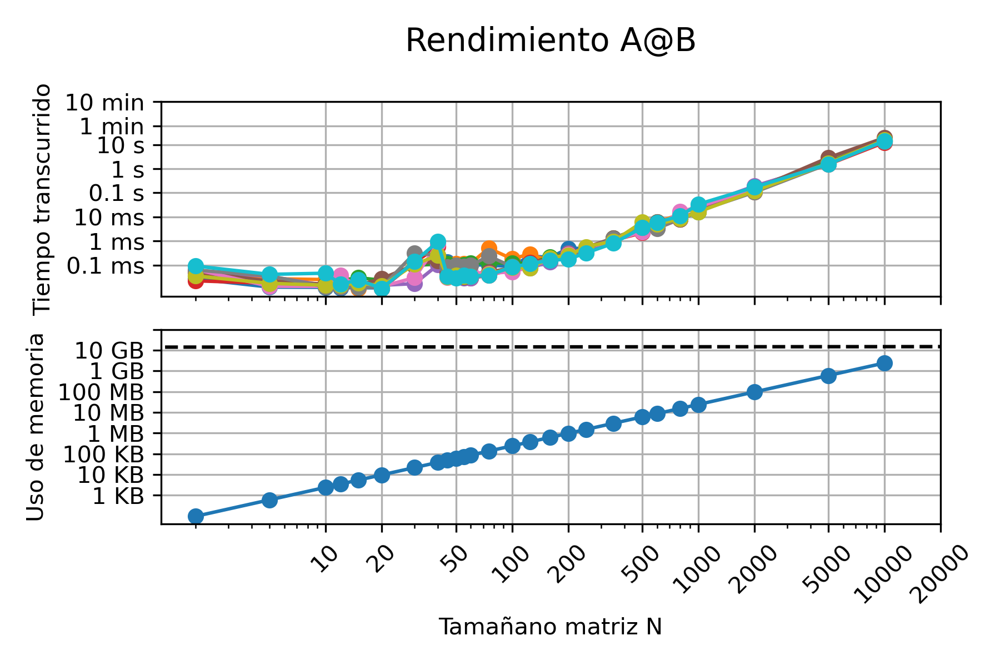
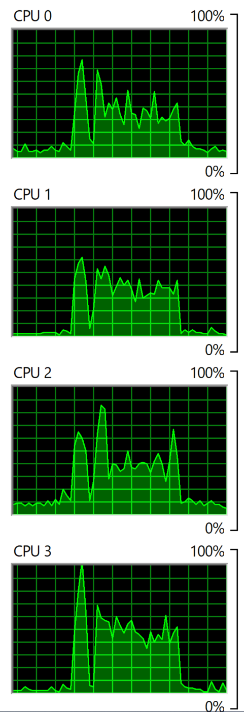
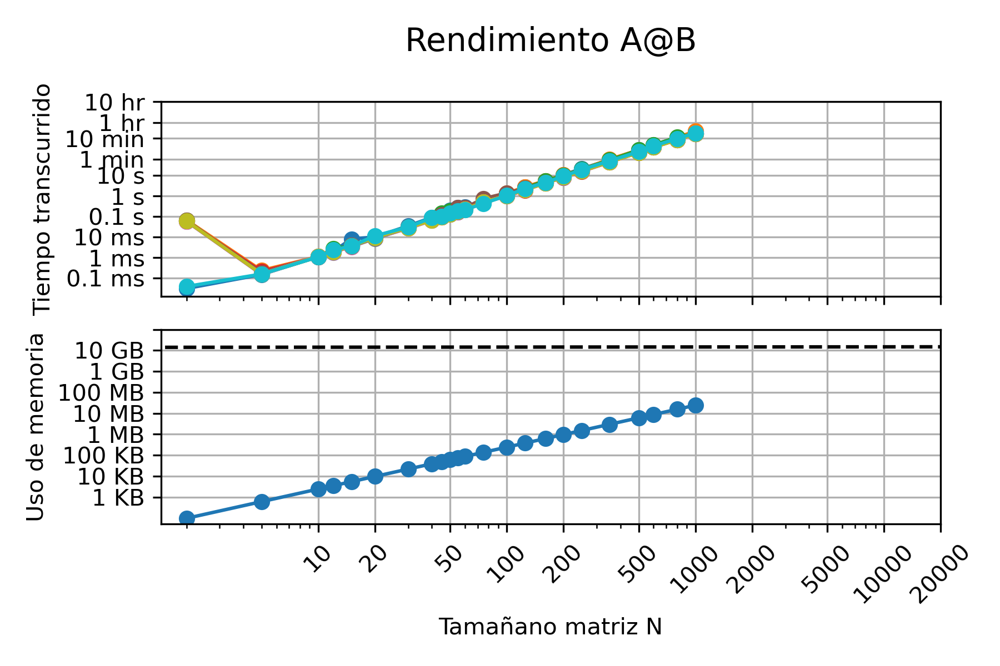
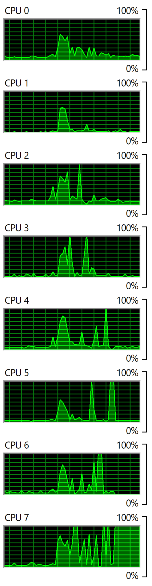

# MCOC2020-P0

# Mi computador principal

* Marca/Modelo: Dell XPS 15 9550

* Tipo: Notebook

* Año adquisición: 2018

* Procesador: 
  - Marca/Modelo: Intel(R) Core(TM) i7-6700HQ
  - Velocidad Base: 2.60 GHz
  - Velocidad Máxima: 3.50 GHz
  - Numero de núcleos: 4
  - Humero de hilos: 8
  - Arquitectura: x64
  - Set de instrucciones: Intel® SSE4.1, Intel® SSE4.2, Intel® AVX2
  
* Tamaño de las cachés del procesador:
  - L1D: 32KB 
  - L1I: 32KB
  - L2: 256KB
  - L3: 6MB
  
* Memoria
  - Total: 16 GB
  - Tipo memoria: DDR4
  - Velocidad 2133 MHz
  - Numero de (SO)DIMM: 2

* Tarjeta Gráfica
  - Marca / Modelo: Nvidia GeForce GTX 960M
  - Memoria dedicada: 2 GB
  - Resolución: 3840 x 2160

* Disco 1:
  - Marca: Samsung
  - Tipo: SSD
  - Tamaño: 512GB
  - Particiones: 3
  - Sistema de archivos: NTFS

* Dirección MAC de la tarjeta wifi: 60:6D:C7:C6:4F:57

* Dirección IP (Interna, del router): 192.168.0.1

* Dirección IP (Externa, del ISP): 201.239.193.246

* Proveedor internet: VTR Banda Ancha S.A.

# Desempeño MATMUL

* ¿Como difiere del gráfico del profesor/ayudante?  
Para matrices entre 20x20 y 50x50 el computador del profesor requere menos tiempo, para matrices entre 50x50 y 2.000x2.000 es mi computador el que requiere menos tiempo.
Para el gráfico de memoria usada, la línea puntada en el gráfico del profesor es a los 32 GB, en cambio en el mio es a los 16 GB, ya que es la memoria RAM instalada en cada uno de los compatudores.

* ¿A qué se pueden deber las diferencias?  
Debe ser por las especificaciones de cada computador, diferencias en el procesador y cantidad de núcleos e hilos.

* El gráfico de uso de memoria es lineal con el tamaño de matriz, pero el de tiempo transcurrido no lo es ¿porqué puede ser?  
Porque es el tamaño en bytes de la matriz, el cual es el mismo si depender de los números en ella.

* ¿Qué versión de python está usando?  
La versión de python usada es Python 3.8.

* ¿Qué versión de numpy está usando?  
La versión numpy usada es 1.18.5.

* Durante la ejecución de su código ¿se utiliza más de un procesador? Muestre una imagen de su uso de procesador durante alguna corrida para confirmar. 
 Como se ve en el siguente gráfico se usan los 4 proceadores de mi computador.

  

# Desempeño MIMATMUL

* ¿Como difiere del gráfico del profesor/ayudante?  
Ambos gráficos son similares ya que se produce un aumento lineal en el tiempo de ejecución.

* ¿A qué se pueden deber las diferencias?  
Algunas diferencias pueden ser debido a la forma de hacer el código para la multiplicación, ya que uno puede ser más optimizado y limpio que otro.

* El gráfico de uso de memoria es lineal con el tamaño de matriz, pero el de tiempo transcurrido no lo es ¿porqué puede ser?  
Porque es el tamaño en bytes de la matriz, el cual es el mismo si depender de los números en ella.

* ¿Qué versión de python está usando?  
La versión de python usada es Python 3.8.

* ¿Qué versión de numpy está usando?  
La versión numpy usada es 1.18.5.

* Durante la ejecución de su código ¿se utiliza más de un procesador? Muestre una imagen de su uso de procesador durante alguna corrida para confirmar. 
 Como se ve en el siguente gráfico se usan los 8 proceadores de mi computador.

  

