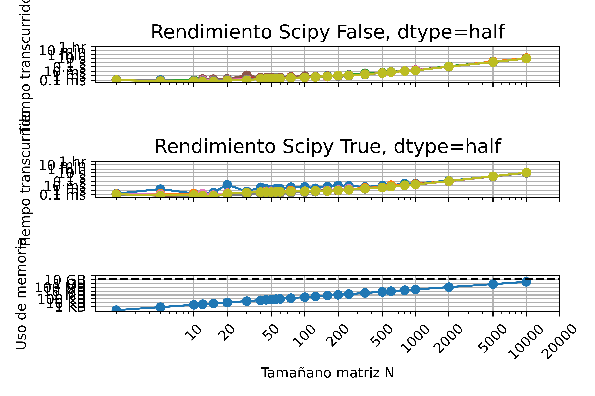
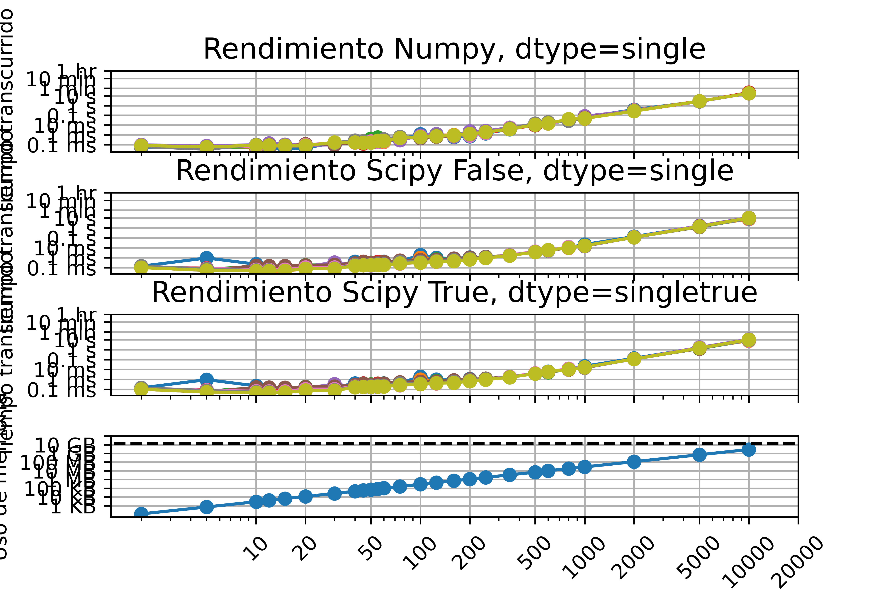
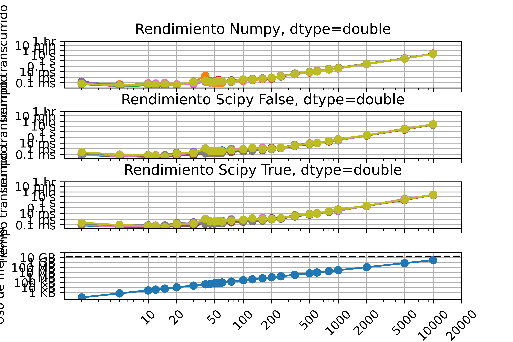
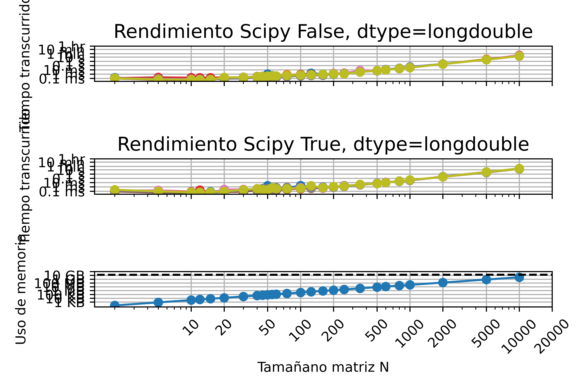
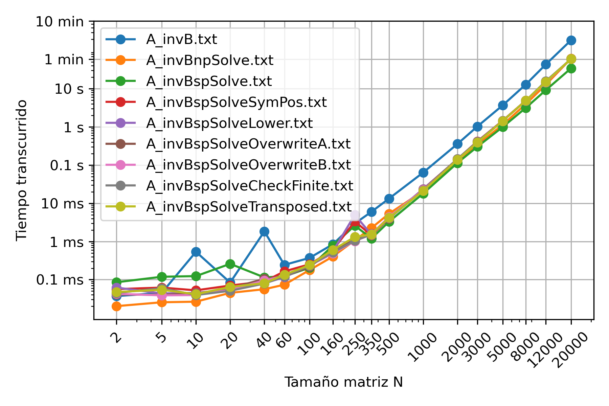

# MCOC2020-P0

# Mi computador principal

* Marca/Modelo: Dell XPS 15 9550

* Tipo: Notebook

* Año adquisición: 2018

* Procesador: 
  - Marca/Modelo: Intel(R) Core(TM) i7-6700HQ
  - Velocidad Base: 2.60 GHz
  - Velocidad Máxima: 3.50 GHz
  - Numero de núcleos: 4
  - Humero de hilos: 8
  - Arquitectura: x64
  - Set de instrucciones: Intel® SSE4.1, Intel® SSE4.2, Intel® AVX2
  
* Tamaño de las cachés del procesador:
  - L1D: 32KB 
  - L1I: 32KB
  - L2: 256KB
  - L3: 6MB
  
* Memoria
  - Total: 16 GB
  - Tipo memoria: DDR4
  - Velocidad 2133 MHz
  - Numero de (SO)DIMM: 2

* Tarjeta Gráfica
  - Marca / Modelo: Nvidia GeForce GTX 960M
  - Memoria dedicada: 2 GB
  - Resolución: 3840 x 2160

* Disco 1:
  - Marca: Samsung
  - Tipo: SSD
  - Tamaño: 512GB
  - Particiones: 3
  - Sistema de archivos: NTFS

* Dirección MAC de la tarjeta wifi: 60:6D:C7:C6:4F:57

* Dirección IP (Interna, del router): 192.168.0.1

* Dirección IP (Externa, del ISP): 201.239.193.246

* Proveedor internet: VTR Banda Ancha S.A.

# Desempeño MATMUL

* ¿Como difiere del gráfico del profesor/ayudante?  
Para matrices entre 20x20 y 50x50 el computador del profesor requere menos tiempo, para matrices entre 50x50 y 2.000x2.000 es mi computador el que requiere menos tiempo.
Para el gráfico de memoria usada, la línea puntada en el gráfico del profesor es a los 32 GB, en cambio en el mio es a los 16 GB, ya que es la memoria RAM instalada en cada uno de los compatudores.

* ¿A qué se pueden deber las diferencias?  
Debe ser por las especificaciones de cada computador, diferencias en el procesador y cantidad de núcleos e hilos.

* El gráfico de uso de memoria es lineal con el tamaño de matriz, pero el de tiempo transcurrido no lo es ¿porqué puede ser?  
Porque es el tamaño en bytes de la matriz, el cual es el mismo si depender de los números en ella.

* ¿Qué versión de python está usando?  
La versión de python usada es Python 3.8.

* ¿Qué versión de numpy está usando?  
La versión numpy usada es 1.18.5.

* Durante la ejecución de su código ¿se utiliza más de un procesador? Muestre una imagen de su uso de procesador durante alguna corrida para confirmar. 
 Como se ve en el siguente gráfico se usan los 4 proceadores de mi computador.

  

# Desempeño MIMATMUL

* ¿Como difiere del gráfico del profesor/ayudante?  
Ambos gráficos son similares ya que se produce un aumento lineal en el tiempo de ejecución.

* ¿A qué se pueden deber las diferencias?  
Algunas diferencias pueden ser debido a la forma de hacer el código para la multiplicación, ya que uno puede ser más optimizado y limpio que otro.

* El gráfico de uso de memoria es lineal con el tamaño de matriz, pero el de tiempo transcurrido no lo es ¿porqué puede ser?  
Porque es el tamaño en bytes de la matriz, el cual es el mismo si depender de los números en ella.

* ¿Qué versión de python está usando?  
La versión de python usada es Python 3.8.

* ¿Qué versión de numpy está usando?  
La versión numpy usada es 1.18.5.

* Durante la ejecución de su código ¿se utiliza más de un procesador? Muestre una imagen de su uso de procesador durante alguna corrida para confirmar. 
 Como se ve en el siguente gráfico se usan los 8 proceadores de mi computador.

  

# Desempeño INV
* Utilizando el comando sys.getsizeof(), se obtubieron los siguentes valores para los tipos de datos:  
  - Half: 26 bytes  
  - Single: 28 bytes  
  - Double: 32 bytes  
  - Longdouble: 32 bytes  
* Los siguentes gráficos muestran el desempeño de las funciones  numpy.linalg.inv , scipy.linalg.inv con overwrite_a=False y scipy.linalg.inv con overwrite_a=True , para los distintos tipos de datos.  

  
* No pude lograr correr el caso 1, de Numpy para variables tipo np.half ni np.longdouble. A partir de los gráficos se logra apreciar que la función invertir de Numpy es la que requiere más tiempo de los tres casos. Con respecto a las variables, son los casos de longdouble y double los que requieren más tiempo de ejecución sin ser extremadamente mayores.
* Qué algoritmo de inversión cree que utiliza cada método (ver wiki)?  
  - Numpy debe invertir por medio de pivoteo o diagonalización de la matriz, ya que es el que demora más en resolverla. Scipy debe descomponer la matriz para realizar los cálculos en menos iteraciones, con el overwrite = True se eliminan valores por lo que se utiliza menos memoria y funciona más rápido. 
* ¿Como incide el paralelismo y la estructura de caché de su procesador en el desempeño en cada caso? (Ver clase 10 Agosto)  
  - Se puede notar que a medida que el tipo de dato pesa más bytes, requiere mayor tiempo en su ejecución, lo que hace que se requieran más núcleos del procesador en forma activa para repartir las taréas entre ellos. Probablemente Scipy realiza una repartición más optimizada que Numpy ya que realiza las tareas en menos tiempo.

# Entrega6 - Desempeño de Ax = b (Parte 2)  
  
* A partir del gráfico se puede ver que el tiempo de ejecución aumenta a medida que aumenta el tamaño de las matrices, junto con esto el método que demora más es el que primero se invierte la matriz para luego multiplicarla por B. Para matrices pequeñas, menores a 20x20 se puede ver que el Solver de Scipy es el más lento, luego para matrices sobre los 350x350 es el que demora menos tiempo. Para matrices menores a 100x100 es el Solver de Numpy el que requiere menos tiempo. Para el resto de las configuraciones del Solver de Scipy no se nota una gran diferencia entre ellos.
